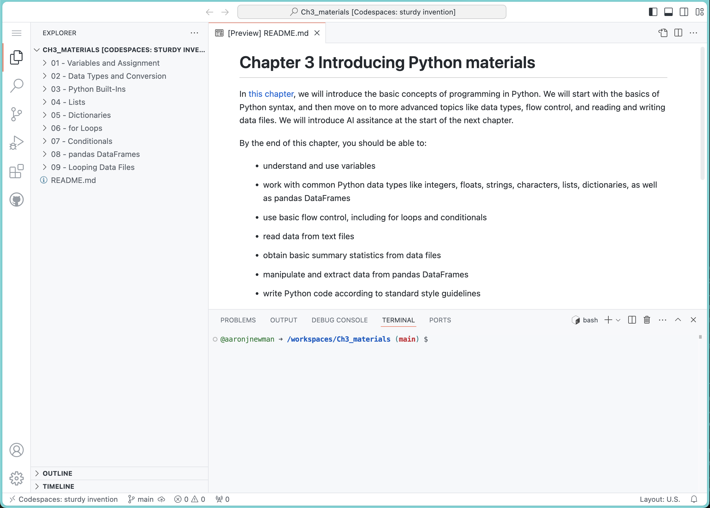

# GitHub Codespaces

GitHub Codespaces is a service provided by GitHub that allows you to run a virtual machine in the cloud, and code in a web-based version of the VS Code IDE (an IDE is an "integrated development environment" --- basically and editor with added tools that are useful in writing and running code). This is a great way to get started, because you don't need to install anything on your own computer. And, because all the course materials are distributed via GitHub already, it's very easy to use these to work through the course materials. 

To get started with Codespaces, you first need to create a GitHub account, which was covered in the previous section. If you haven't done that yet, go back and do it now, and be sure you're logged in to GitHub before you continue.

## Your first Codespace

The first "content" chapter of this textbook, where there are code file to work through, is the next chapter: [Introducing Python](3-python/introduction.html). Let's open that up as a codespace!

To do this, go to the GitHub page for the *Introducing Python* materials, which is [here](https://github.com/neural-data-science/Introducing-Python). You should see a green button that says "Use this template". Click on this button, and select the "Create a new repository" option. This will open a page where you provide some basic information. Most importantly, about halfway down teh page it will have a field for "Repository name". You can name this whatever you like, but I suggest something like `Ch3_materials` or `Python_Intro`. You can also choose to have the repository public (in which case, anyone viewing your GitHub profile can see it), or private (in which case, only you can see it). If you have a free (not student) GitHub account, you can only have a limited number of private repositories, so you may want to make this one public. Once you've named it, click the green "Create" button at the bottom.

This will create a new repository in your GitHub account, with all the materials from the *Introducing Python* chapter. This is a *copy* of the main repository. That means that any change you make to the files in this repository will not affect the main repository. This is your own personal version of the materials, that you can work through and modify as you like.

You can now open this repository in a Codespace by clicking on the green "Code" button, select the `Codespaces` tab, and selecting "Create codespace on main". This will open a new tab in your browser, with a virtual machine running in the cloud, and the VS Code IDE running in that virtual machine. You can now work through the chapter materials in this virtual environment.

:::{tip}
There are many ways to customize your Codespace, including installing additional software, changing the color theme, and adding extensions. You can also save your Codespace, so that you can return to it later. You can learn more about Codespaces in the [GitHub documentation](https://docs.github.com/en/codespaces).

As a first step, if you want to change the color theme of the VS Code editor in your Codespace, you can do this by clicking on the gear icon in the bottom left corner of the window, and then clicking on "Color Theme". You can then choose from a variety of themes. You can also install additional themes by clicking on the "Install Additional Color Themes" button at the bottom of the list.
:::