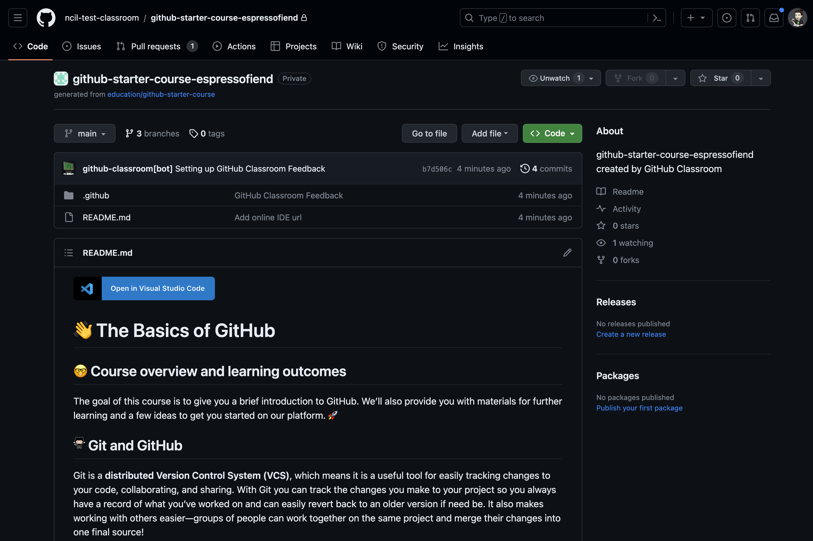

## Exploring the GitHub Repository view

When you open the assignment repository, you will see the default view of the repository, which is basically what every repository on GitHub looks like. It will look something like this:

At the top left of the window is the name of the organization repository you are currently looking in. Note that when you use GitHub classroom, all of the repositories you clone from there will be owned by the organization associated with the course (e.g., `neural-data-science-2023-24`), and the name of your copy of the repository will have your GitHub user name attached to the end. Below this are tabs including `Code` (which you are currently viewing), `Issues`, `Pull requests`, `Actions`, `Projects`, `Wiki`, `Security`, and `Insights`. We'll explore some of these later, but for now we'll focus on the `Code` tab.

Below the tabs is the name of the repository, and then a few buttons. We'll ignore the buttons for now. Below these is a list of all the files in this repository. This first one is quite bare, with only a `.github` folder (which you should ignore and never mess with; it just contains the files GitHub uses to manage and sync the repository), and a file called `README.md`. The contents of the README file are displayed below the list of files. This is the default view of a repository, and it's standard for every repository to have a `README.md` file that explains what the repository is for and about, if not more detailed information (e.g., documentation). The `.md` extension indicates that this is a [Markdown](../2-nds/markdown.md) file, which is a simple text format that allows you to add formatting to text files. You can read more about Markdown [here](https://guides.github.com/features/mastering-markdown/).

If you scroll down the page, you will see the contents of the README file. Read it over, and explore some of the links if you're interested. The content is actually useful, and from here on we'll assume you've read this material and understand it.

The README file ends with a list of *Optional next steps*. You should do all of these steps, and then submit the assignment. We'll walk you through some of this, but some of it is left for you to figure out; the README provides you with all the resources you need to do all of these tasks.
