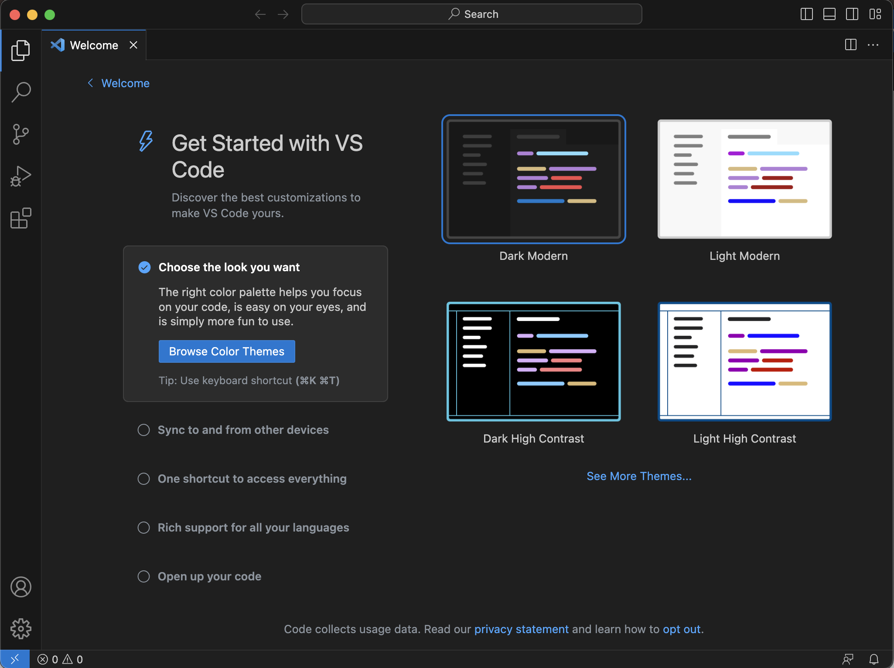

# VS Code
As described [earlier](../2-nds/vscode.md), [Visual Studio Code](https://code.visualstudio.com/Download) is a software package (an IDE, or integrated development environment) for writing and running code. This is the "home base" platform you will use in this course for all of your coding, as well as for syncing your code with GitHub. Download it now from the link above, and install it on your computer. Note that on a Mac, VS Code downloads simply as an application that you should drag from your Downloads folder into your Applications folder. On Windows, it downloads as an installer that you need to run. On Linux, you can download a `.deb` file that you can install using `dpkg -i`, or you can install it from the command line using `sudo snap install --classic code`.

Once you have installed VS Code, open it. You will see a welcome screen that looks like this:


THe first important step is to choose your preferred colour scheme! I like to use a dark theme, but it's entirely personal preference. To change the theme, click on the gear icon in the bottom left corner of the window, and then click on "Color Theme". You can then choose from a variety of themes. You can also install additional themes by clicking on the "Install Additional Color Themes" button at the bottom of the list.

## Sign in to GitHub within VS Code
Since VS Code and GitHub are Microsoft products, they integrate very well. You can sign in to your GitHub account from within VS Code, which will allow you to sync your code with GitHub and access features such as the **GitHub Copilot** AI assistant. To do this, click on icon near the bottom left of the screen that looks like a person's head and shoulders. Then click on "Turn on Settings Sync...". Now at the *top* of the VS Code window, you should see a message that says "Sign in to and Turn on". Click on this button, and then click on "Sign in with GitHub". You will be prompted to sign in to your GitHub account. Once you have done this, allow the authorizations that are requested. you should see a message at the top of the VS Code window that says "Sync is turned on". You can now close the "Welcome" tab.

## Extensions
Extensions are add-ons to VS Code that add functionality to the program. Once you have installed VS Code, you should install the extensions you'll need for this course. To do this, open VS Code, and click on the "Extensions" icon in the left-hand toolbar (it looks like a square with four squares inside it). Then search for each of the extensions below (some of them may show up automatically, as they are among the most commonly-installed), and click the "Install" button for each one. You may need to restart VS Code after installing each extension.

Install each of these extensions, in this order:
- **Python**
  - On a Mac, you may be prompted to install "Developer Tools" when you install this extension. It's important that you do this.
- **Pylance**
- **Jupyter**
- **GitHub Classroom**
- **GitHub Copilot**
- **GitHub Copilot Chat** 
- **GitHub Copilot Labs**
- **Copilot Theme** (optional, but currently my favourite; search just for "theme" if you want to explore other options)
- **Helium icon theme** (again optional, but I like it; search "icon theme" if you want to explore other options)

---

## Help VS Code find the git application (if necessary)

While you can simply use GitHub desktop throughout this course to work with GitHub, it is also possible to work with GitHub from within VS Code. On a Mac, this requires a bit of extra work, as VS Code needs to be told where to find the `git` application that is installed with GitHub Desktop. If you are using Windows or Linux, you can skip this step. If you are using a Mac, first confirm that you need to do it: in VS Code, on the left-hand toolbar, click on the "Source Control" icon (it is usually the third icon down, and has three small circles connected by lines). If you see a message that says that you need to install git, then you need to do this step. If you see a message that includes buttons for "Open Folder" and "Clone Repository", then you're all set and you can skip this step.

Unfortunately this step is a bit complicated, but bear with us. You will want to be able to work with GitHub from within VS Code. Unfortunately, at least on a Mac, VS Code needs some help finding where the required `git` application was installed. The `git` application was installed on your Mac when you installed Developer Tools. You just need to tell VS Code where to find it.

In VS Code, click on the "cog" icon in the bottom left, and choose "Settings". Click on "Search settings" at the top of the window that opens, and type `git path`. The first result should be the `Git: Path` setting; click on the `Edit in settings.json` link. YOu will see something like this:
```json
{
    "git.path": ""
}
```
Se the path by putting `/usr/bin/git` between the quotation marks, so that it looks like this:
```json
{
    "git.path": "/usr/bin/git"
}
```
Now save the file (`File -> Save`), and close the window. Quit VS Code and restart it. You should now be able to use GitHub from within VS Code.

```{note}
This is perhaps your first coding experience in this course! Congratulations! You have just edited a JSON file. JSON is a very common format for storing data, and is used extensively in web development. In this case, your are setting the parameter `git.path` by pointing it at the location on your hard drive of the `git` application.

This is also your first opportunity to create a bug. Pay careful attention to the *syntax* of your edit. For example, if you accidentally delete the quote marks rather than putting `"/usr/bin/git"` inside them, you will get an error message when you try to save the file. If this happens, just put the quote marks back in, and try again.
```
